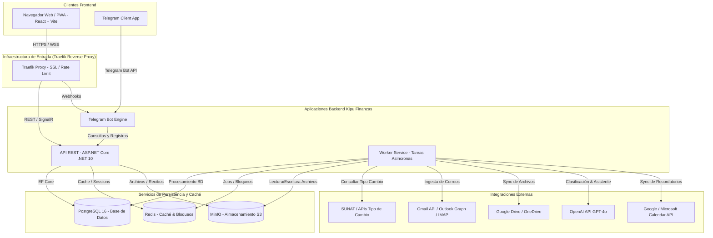

# Kipu Finanzas - Documento de Arquitectura de Software

## 1. Visión General del Sistema

**Kipu Finanzas** es una plataforma avanzada de administración financiera personal y familiar, diseñada con una arquitectura modular, extensible, altamente segura y preparada para producción. El sistema consolida cuentas bancarias, tarjetas de crédito, ingresos, gastos, presupuestos, transferencias internas, cambio de divisas (PEN/USD), depósitos a plazo fijo, metas de ahorro, estados de cuenta, documentos e integraciones automatizadas (Correo, Almacenamiento en la Nube, Calendarios, Telegram y OpenAI).

---

## 2. Estructura del Monorepo

El proyecto está organizado como un **Monorepo** multi-aplicación y multi-paquete:

```text
kipu-finanzas/
├── apps/
│   ├── web/                # Aplicación Web Frontend (React + TypeScript + Vite)
│   ├── api/                # REST API Backend (ASP.NET Core .NET 10 Web API)
│   ├── worker/             # Servicio en segundo plano para OCR, IA, Sync e Importación (Worker Service)
│   └── telegram-bot/       # Bot interactivo de Telegram (.NET Worker / Webhook service)
├── packages/
│   ├── shared-contracts/   # DTOs, Requests/Responses comunes en C#
│   ├── shared-types/       # Definiciones e interfaces TypeScript para el frontend
│   └── ui/                 # Componentes UI reutilizables (Mantine wrappers / componentes base)
├── infrastructure/
│   ├── docker/             # Dockerfiles multi-stage para cada app
│   ├── dokploy/            # Configuraciones de despliegue en Dokploy
│   ├── traefik/            # Enrutamiento dinámico, SSL y Labels de Traefik
│   ├── monitoring/         # Configuraciones de Prometheus, Grafana y OpenTelemetry
│   └── backup/             # Scripts automáticos de respaldo para PostgreSQL y MinIO
├── database/
│   ├── migrations/         # Migraciones EF Core para PostgreSQL
│   ├── seed/               # Datos iniciales (Bancos de Perú, Categorías por defecto, Permisos)
│   └── scripts/            # Scripts Maint/SQL utilitarios
├── tests/
│   ├── unit/               # Pruebas unitarias (xUnit / Vitest)
│   ├── integration/        # Pruebas de integración de API y BD (Testcontainers)
│   ├── e2e/                # Pruebas End-to-End (Playwright)
│   └── fixtures/           # Archivos bancarios de prueba (PDF, CSV, Excel, Imágenes)
├── docs/                   # Documentación del sistema
│   ├── architecture.md
│   ├── domain-model.md
│   ├── security.md
│   ├── integrations.md
│   ├── banking-imports.md
│   ├── deployment.md
│   └── implementation-plan.md
├── docker-compose.yml      # Entorno de desarrollo local
├── docker-compose.production.yml # Entorno de producción Dokploy
├── .env.example
└── README.md
```

---

## 3. Decisiones de Stack Tecnológico

### 3.1 Frontend (`apps/web`)
* **Framework:** React 19 con TypeScript.
* **Build Tool:** Vite para compilación ultrarrápida y HMR.
* **Enrutamiento:** React Router v7.
* **Gestión de Estado y Servidor:** TanStack Query v5 (React Query) para caché de API e invalidaciones automáticas.
* **Formularios y Validación:** React Hook Form + Zod.
* **Diseño y Componentes:** Mantine UI v7 (soporte nativo de Modo Oscuro/Claro, i18n, componentes accesibles y diseño responsive).
* **Gráficos y Dashboards:** Recharts / Apache ECharts.
* **Capacidades PWA:** Vite PWA Plugin para soporte offline parcial y experiencia mobile-first.
* **Configuración Regional:**
  * **Idioma:** Español (`es-PE`).
  * **Zona Horaria:** `America/Lima` (UTC-5).
  * **Monedas Base:** PEN (Soles Peruvian S/) y USD ($ Dólares Estadounidenses).

### 3.2 Backend (`apps/api`)
* **Framework:** ASP.NET Core Web API sobre **.NET 10 LTS**.
* **Lenguaje:** C# 14.
* **Persistencia:** Entity Framework Core 10 con proveedor PostgreSQL (`Npgsql.EntityFrameworkCore.PostgreSQL`).
* **Patrón de Arquitectura:** Arquitectura Modular / Clean Architecture Pragmática (Dominio, Aplicación, Infraestructura, API).
* **Validación de Entradas:** FluentValidation.
* **Documentación API:** OpenAPI (Swagger / Scalar UI).
* **Logging y Observabilidad:** Serilog con Sinks para Consola/Loki/PostgreSQL + OpenTelemetry.
* **Notificaciones en Tiempo Real:** ASP.NET Core SignalR.
* **Caché y Mensajería:** Redis (StackExchange.Redis) para sesiones, caché y bloqueos distribuidos.
* **Almacenamiento de Archivos:** MinIO (SDK S3-compatible) para almacenar adjuntos, recibos y PDFs.
* **Seguridad y Usuarios:** ASP.NET Core Identity con JWT, Refresh Tokens rotativos y OAuth 2.0.

### 3.3 Procesamiento Asíncrono (`apps/worker`)
* **Framework:** .NET BackgroundService / Worker Service con Quartz.NET / Hangfire.
* **Funcionalidad:**
  * Lectura e ingesta de correos (Gmail API, Outlook Graph, IMAP).
  * Descarga y sincronización de carpetas en Google Drive y OneDrive.
  * Procesamiento OCR de documentos e imágenes.
  * Clasificación heurística e IA (OpenAI API).
  * Motor de conciliación y detección de duplicados.
  * Envío de alertas y notificaciones push / email / Telegram.
  * Respaldos periódicos.

---

## 4. Diagrama de Componentes del Sistema



---

## 5. Decisiones de Arquitectura y Principios de Diseño

1. **Aislamiento Multi-inquilino por Familia:** Cada consulta a la base de datos está filtrada obligatoriamente por el `FamilyId` del usuario autenticado mediante EF Core Global Query Filters.
2. **Desacoplamiento de Servicios:** El backend expone contratos compartidos (`shared-contracts`) consumibles tanto por la API REST como por el Bot de Telegram y el Worker.
3. **Cero almacenamiento de secretos bancarios:** El sistema **NUNCA** solicita ni almacena claves de acceso a banca por internet, PINs ni CVVs de tarjetas.
4. **Resiliencia Operativa:** Si un servicio externo (ej. SUNAT u OpenAI) falla, la aplicación continúa operando mediante valores de respaldo o modos manuales.
