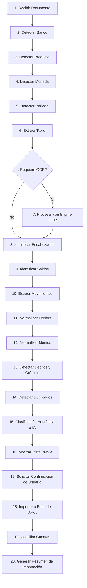

# Kipu Finanzas - Documento de Importación Bancaria y OCR

## 1. Visión General del Módulo de Importación

El módulo de importación bancaria de **Kipu Finanzas** permite transformar extractos bancarios y comprobantes físicos o digitales en movimientos financieros estructurados dentro del sistema. Soporta las principales entidades financieras de Perú (**BCP, BBVA, Interbank, Banco Falabella**) y diversos formatos de entrada.

---

## 2. Formatos y Bancos Soportados

### 2.1 Formatos de Archivo Soportados
1. **PDF con texto vectorial:** Estados de cuenta digitales descargados de la web/app bancaria.
2. **PDF escaneado / Imagen:** Documentos digitalizados o impresos.
3. **Excel (`.xlsx`, `.xls`) / CSV:** Reportes exportados de banca por internet.
4. **OFX / QFX:** Formatos estándar de intercambio financiero.
5. **Imágenes / Fotografías (`.jpg`, `.png`):** Capturas de pantalla de la app móvil o fotos de vouchers de consumo.

### 2.2 Adaptadores por Banco (Perú)
* **BCP (Banco de Crédito del Perú):** Cuentas de Ahorro/Sueldo PEN/USD y Tarjetas de Crédito BCP (Latam Pass, etc.).
* **BBVA Perú:** Cuentas de Ahorro e Tarjetas de Crédito BBVA.
* **Interbank:** Cuentas Ahorro/Simple y Tarjetas de Crédito Interbank.
* **Banco Falabella:** Estado de cuenta Tarjeta CMR y Cuenta Banco Falabella.

---

## 3. Flujo de Procesamiento en 20 Pasos

---

## 4. Validaciones Determinísticas Matelmáticas

Antes de presentar la vista previa al usuario, el sistema aplica una validación contable estricta:

$$\text{Saldo Inicial} + \sum \text{Créditos (Ingresos)} - \sum \text{Débitos (Egresos)} = \text{Saldo Final Calculado}$$

Si $\text{Saldo Final Calculado} \neq \text{Saldo Final del Documento}$, el sistema marca el documento con el estado `Requiere Revisión` y resalta las filas no interpretadas o los descuadres encontrados. **Nunca se confía ciegamente en la IA ni en el OCR.**

---

## 5. Pipeline de Procesamiento OCR

Para archivos escaneados o fotografías:
1. **Preprocesamiento de Imagen:**
   * Grayscale & Binarización adaptativa.
   * Enderezado (Deskew) y corrección de perspectiva.
   * Ajuste de contraste e iluminación.
2. **Detección de Tablas y Estructura:**
   * Localización de columnas (Fecha, Descripción, Monto, Saldo).
3. **Extracción de Campos Clave:**
   * Fecha de transacción (`YYYY-MM-DD`).
   * Nombre del comercio o establecimiento (`Merchant`).
   * Monto total e impuestos (IGV 18% si aplica).
   * Moneda (S/ o US$).
   * Número de operación / Referencia bancaria.
