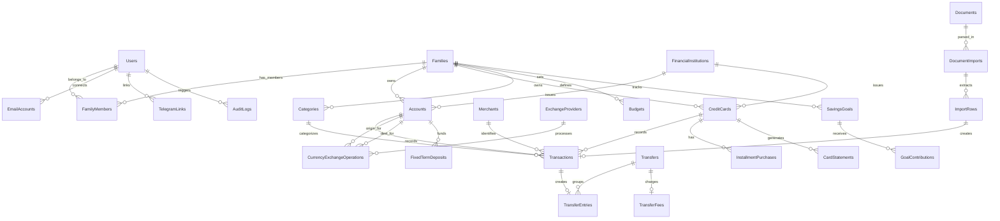

# Kipu Finanzas - Modelo de Dominio y Diagrama Entidad-Relación

## 1. Visión General del Dominio Financiero

El dominio de **Kipu Finanzas** modela la realidad financiera de una persona o núcleo familiar. Maneja la convivencia multi-moneda (PEN y USD) en el contexto peruano, incluyendo operaciones de banca tradicional (BCP, BBVA, Interbank, Banco Falabella), efectivo, tarjetas de crédito con compras en cuotas, transferencias entre cuentas propias, operaciones de cambio de moneda (casas de cambio / cambistas), depósitos a plazo fijo, presupuestos, metas de ahorro e importaciones asistidas por OCR e IA.

---

## 2. Entidades de Dominio Principales

### 2.1 Usuarios, Familias y Permisos
* **`Users`**: Usuario de la plataforma (Email, PasswordHash, Nombre, Preferencias, Configuración de MFA).
* **`Families`**: Entidad familiar (Organización o Núcleo Financiero). Contiene `Currency` base (default PEN).
* **`FamilyMembers`**: Relación M:N entre Usuarios y Familias con Rol (`Admin`, `Member`, `ReadOnly`).
* **`Invitations`**: Invitaciones pendientes para unirse a una familia via Token con expiración.
* **`Roles` & `Permissions`**: Definición granular de permisos de acceso.

### 2.2 Instituciones y Cuentas Financieras
* **`FinancialInstitutions`**: Entidad bancaria o financiera (BCP, BBVA, Interbank, Falabella, etc.).
* **`Accounts`**: Cuenta bancaria o de efectivo (Sueldo, Ahorros, CTS, Corriente, Inversión, Efectivo PEN, Efectivo USD).
  * Campos: `BalanceAvailable`, `BalanceBook`, `Currency` (PEN/USD), `IsIncludedInNetWorth`, `PrivacyLevel` (`Family`, `Shared`, `Private`).
* **`CreditCards`**: Tarjeta de crédito.
  * Campos: `CreditLimit`, `AvailableLimit`, `ClosingDay`, `DueDay`, `MainCurrency`, `SecondaryCurrency`.
* **`CardStatements`**: Estado de cuenta mensual de tarjeta (Pago Total, Pago Mínimo, Fecha de Corte, Fecha de Pago).

### 2.3 Movimientos Financieros y Transferencias
* **`Transactions`**: Transacción o movimiento básico (Ingreso, Gasto, Devolución, Interés, Comisión, Ajuste).
  * Campos: `Amount`, `Currency`, `ConvertedAmount`, `ExchangeRate`, `TransactionType`, `Category`, `Merchant`, `Status`, `DeduplicationHash`.
* **`Transfers`**: Entidad que agrupa transferencias entre cuentas propias.
  * Vincula una `Transaction` de salida (Débito) y una `Transaction` de entrada (Crédito).
* **`TransferEntries`**: Registro detallado de débitos y créditos en la transferencia.
* **`TransferMatches`**: Propuestas de conciliación/coincidencia automática de transferencias con nivel de confianza.
* **`TransferFees`**: Registro explícito de comisiones cobradas en una transferencia (registrado como gasto).

### 2.4 Operaciones Cambiarias (Compra y Venta de Dólares)
* **`CurrencyExchangeOperations`**: Operación de cambio PEN/USD.
  * Campos: `OriginAccount`, `DestinationAccount`, `DeliveredAmount`, `DeliveredCurrency`, `ReceivedAmount`, `ReceivedCurrency`, `EffectiveRate`, `SunatRate`, `FeeAmount`.
* **`ExchangeProviders`**: Proveedores de cambio (Casas de cambio digitales como Rextie, Tkambio, Cambix, Banco, etc.).
* **`ExchangeRates`**: Histórico diario de tipos de cambio (Compra, Venta, SUNAT, Fuente).

### 2.5 Tarjetas y Compras en Cuotas
* **`InstallmentPurchases`**: Compra realizada en cuotas en tarjeta de crédito.
  * Campos: `TotalAmount`, `TotalInstallments`, `CurrentInstallment`, `MonthlyAmount`, `InterestAmount`, `FirstDueDate`.

### 2.6 Categorización, Presupuestos y Metas
* **`Categories`**: Categorías y Subcategorías jerárquicas de ingresos y gastos.
* **`CategoryRules`**: Reglas automáticas de categorización basadas en patrones del comercio/descripción.
* **`Merchants`**: Comercios o establecimientos normalizados (ej. "NETFLIX", "PRIMAX").
* **`Budgets` & `BudgetItems`**: Presupuestos mensuales/anuales por categoría o miembro familiar.
* **`IncomeSources`**: Fuentes de ingreso recurrentes o esperados (Sueldo, Alquileres, Honorarios).
* **`FixedTermDeposits`**: Depósitos a plazo fijo (Capital, Tasa Anual, Vencimiento, Modalidad, Sin cálculo automático de rendimiento).
* **`SavingsGoals` & `GoalContributions`**: Metas de ahorro y sus aportes acumulados.

### 2.7 Documentos, Importaciones e Integraciones
* **`Documents`**: Archivos financieros subidos o descargados (PDF, Excel, Imagen).
* **`DocumentImports`**: Sesión de importación de extracto bancario.
* **`ImportRows`**: Filas individuales extraídas de un estado de cuenta.
* **`ReconciliationSessions`**: Estado de conciliación periódica de cuentas.
* **`EmailAccounts`, `EmailMessages`, `EmailAttachments`**: Ingesta de correos Gmail, Outlook, IMAP.
* **`TelegramLinks`**: Vinculación de cuentas de Telegram con usuarios.
* **`CalendarLinks`**: Sincronización con Google/Microsoft Calendar.
* **`AiConfigurations` & `AiUsageLogs`**: Configuración cifrada de OpenAI API y registro de consumo.
* **`AuditLogs` & `RefreshTokens`**: Registro de auditoría y tokens de sesión.

---

## 3. Reglas de Negocio Críticas (No Negociables)

### 3.1 Transferencias entre Cuentas Propias
1. Las transferencias internas **NO** aumentan ni disminuyen el patrimonio ni el presupuesto familiar.
2. No se computan como ingresos ni como gastos.
3. Si existe una comisión bancaria por la transferencia (ej. transferencia interbancaria), únicamente el monto de la comisión se registra como `Gasto` (categoría *Comisiones Bancarias*).
4. El sistema sugiere vinculaciones de transferencias con una tolerancia de hasta 3 días entre la fecha de salida y de entrada.

### 3.2 Compra y Venta de Dólares (Operaciones Cambiarias)
1. Entregar Soles para recibir Dólares o entregar Dólares para recibir Soles es un intercambio de activos, **NO** un gasto ni un ingreso de capital.
2. **Fórmula del Tipo de Cambio Efectivo:**
   * **Venta de Dólares:** $\text{Tipo de Cambio} = \frac{\text{PEN recibidos}}{\text{USD entregados}}$
   * **Compra de Dólares:** $\text{Tipo de Cambio} = \frac{\text{PEN entregados}}{\text{USD recibidos}}$
3. El tipo de cambio de la SUNAT se guarda únicamente como **referencia** comparativa; la transacción utiliza el tipo de cambio real efectivamente obtenido.
4. El manejo de efectivo en USD o PEN utiliza cuentas virtuales (`Efectivo PEN`, `Efectivo USD`).

### 3.3 Tarjetas de Crédito y Pagos
1. Cada compra realizada con tarjeta de crédito se registra como un `Gasto` en la fecha del consumo.
2. El pago posterior de la tarjeta de crédito desde una cuenta bancaria es un **pago de pasivo / transferencia interna**, **NUNCA** un segundo gasto.
3. Para las compras en cuotas, el saldo pendiente se proyecta en los meses futuros, devengando la cuota correspondiente cada mes.

### 3.4 Depósitos a Plazo Fijo
1. El sistema **NO** calcula ni proyecta automáticamente el interés ganado mediante fórmulas contractuales fijas.
2. El usuario debe poder registrar manualmente los intereses esperados y reales cobrados en la fecha de liquidación.

---

## 4. Diagrama Entidad-Relación (ERD)

