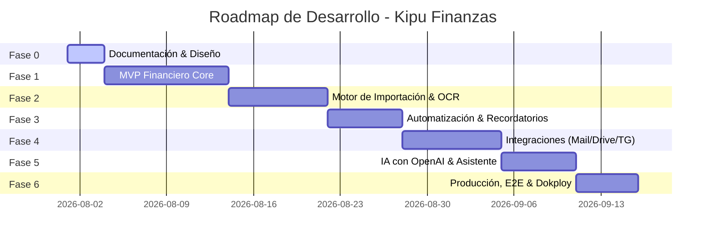

# Kipu Finanzas - Roadmap y Plan de Implementación Detallado

## 1. Visión General del Roadmap

El desarrollo de **Kipu Finanzas** se ejecuta de manera incremental y modular a través de **7 Fases secuenciales**. Cada fase garantiza un estado compilable, probado y desplegable mediante Docker antes de avanzar a la siguiente.

---

## 2. Roadmap por Fases

### Fase 0: Documentación y Definición de Arquitectura (COMPLETADA)
* `docs/architecture.md`: Definición de arquitectura, monorepo y stack.
* `docs/domain-model.md`: Modelo de dominio, reglas no negociables y diagrama ER.
* `docs/security.md`: Estrategia de seguridad, JWT, cifrado AES-256 y privacidad.
* `docs/integrations.md`: Especificación de integraciones (Mail, Drive, Telegram, OpenAI, SUNAT).
* `docs/banking-imports.md`: Formatos, pipeline de 20 pasos y reglas de validación.
* `docs/deployment.md`: Docker multi-stage, Dokploy, Traefik y respaldos.
* `docs/implementation-plan.md`: Roadmap, MVP y backlog.

---

### Fase 1: MVP Financiero Core
* **Backend:**
  * Estructura inicial de solución .NET 10 y proyectos (`api`, `worker`, `telegram-bot`, `shared-contracts`).
  * Autenticación con JWT, ASP.NET Core Identity y Refresh Tokens.
  * Entidades EF Core y migraciones iniciales para PostgreSQL.
  * APIs REST para Cuentas, Tarjetas de Crédito, Movimientos, Transferencias internas y Compra/Venta de Dólares.
  * Motor de tipo de cambio SUNAT (Scraper/API con fallback).
  * Presupuestos y Metas de ahorro iniciales.
* **Frontend:**
  * Estructura Vite + React + Mantine UI.
  * Pantallas de Login, Registro, Dashboard Financiero, Movimientos, Cuentas, Tarjetas, Transferencias, Cambio de Moneda y Presupuestos.
* **Infraestructura:**
  * `docker-compose.yml` para desarrollo local funcional.

---

### Fase 2: Motor de Importación Bancaria y OCR
* Implementación de adaptadores para BCP, BBVA, Interbank y Banco Falabella.
* Parsers para archivos CSV y Excel.
* Extracción de texto de PDF (PDFpig / iText).
* Integración con motor OCR para PDFs escaneados e imágenes de comprobantes.
* Motor de deduplicación mediante Hashing y coincidencia probabilística.
* Pantalla de vista previa e interfaz de conciliación bancaria.

---

### Fase 3: Automatización, Transacciones Recurrentes y Reglas
* Registro de movimientos recurrentes (Sueldos, alquileres, servicios).
* Depósitos a plazo fijo (registro manual de liquidación e intereses).
* Motor de alertas (presupuestos excedidos, tarjetas al 70%, vencimientos próximos).
* Detección de ingresos esperados no recibidos.
* Ejecución de tareas programadas en Quartz.NET / Hangfire.

---

### Fase 4: Integraciones Externas (Correo, Nube, Telegram y Calendarios)
* Servicio Ingesta de Correo (Gmail API, Outlook Graph, IMAP personal).
* Sincronización de carpetas de Google Drive y Microsoft OneDrive.
* Bot de Telegram con vinculación de código de 6 dígitos y comandos `/saldo`, `/gastos`, `/presupuesto`.
* Ingesta interactiva de imágenes/recibos desde Telegram.
* Sincronización de eventos de pago en Google Calendar y Microsoft Calendar.

---

### Fase 5: Inteligencia Artificial con OpenAI
* Servicio de encriptación y gestión de `OPENAI_API_KEY`.
* Clasificación automática y normalización de descripciones de comercios.
* Detección de anomalías en gastos y aumentos de suscripciones.
* Asistente financiero conversacional en la Web App con Tool Calling.

---

### Fase 6: Preparación para Producción, Pruebas E2E y Despliegue
* Hardening de seguridad y auditoría final.
* Pruebas unitarias en C# (xUnit) y React (Vitest).
* Pruebas E2E automatizadas con Playwright.
* Dockerfile multi-stage optimizado para cada servicio.
* Configuración de producción `docker-compose.production.yml` y despliegue en Dokploy detrás de Traefik.

---

## 3. Criterios de Aceptación del MVP (22 Puntos Obligatorios)

1. [x] Crear usuario.
2. [x] Crear familia.
3. [x] Invitar miembro a la familia.
4. [x] Crear cuentas bancarias y de efectivo en PEN y USD.
5. [x] Crear tarjetas de crédito con línea y fecha de corte.
6. [x] Registrar ingreso de sueldo o variable.
7. [x] Registrar gasto categorizado.
8. [x] Registrar transferencia entre cuentas propias sin duplicar patrimonio.
9. [x] Registrar compra de dólares (PEN a USD) con tipo de cambio efectivo.
10. [x] Registrar venta de dólares (USD a PEN) con tipo de cambio efectivo.
11. [x] Registrar comisión bancaria como único gasto en transferencias.
12. [x] Crear presupuesto mensual por categoría.
13. [x] Mostrar barra de avance y ejecución del presupuesto.
14. [x] Crear meta de ahorro con monto objetivo.
15. [x] Registrar depósito a plazo fijo sin cálculo automático de rendimiento.
16. [x] Importar estado de cuenta en formato CSV.
17. [x] Detectar movimientos duplicados durante la importación.
18. [x] Clasificar movimientos automáticamente o manualmente.
19. [x] Mostrar el patrimonio neto consolidado por moneda en el Dashboard.
20. [x] Exportar movimientos a Excel / CSV.
21. [x] Ejecutarse completamente en local mediante Docker Compose.
22. [x] Desplegarse sin errores en Dokploy detrás de Traefik.

---

## 4. Matriz de Riesgos y Mitigaciones

| Riesgo Técnico | Impacto | Mitigación |
| :--- | :--- | :--- |
| Cambios en formatos PDF bancarios (BCP, BBVA, Interbank) | Alto | Separar la lógica en adaptadores modulares aislados y mantener suite de pruebas con fixtures reales. |
| Inconclusiones en OCR o lecturas erróneas de importes | Medio | Validación matemática determinística estricta (Saldo Inicial + Créditos - Débitos = Saldo Final). |
| Bloqueo de API Key de OpenAI o costos elevados | Bajo | Permitir al usuario usar su propia API Key, limitar llamadas y tener motor de reglas heurísticas como respaldo. |
| Fuga de datos entre familias distintas | CRÍTICO | EF Core Global Query Filters obligatorios en todas las entidades con `FamilyId`. |
